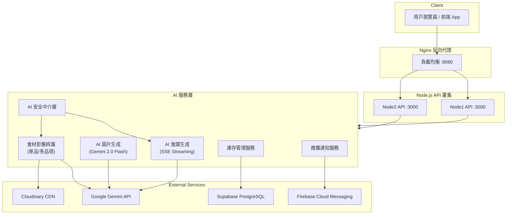

<p align="center">
  <h1 align="center" style="font-weight: 700">🍳 Recipe API - AI 食譜生成與智慧冰箱管理微服務</h1>
</p>

<p align="center">
  <a href="https://gemini-ai-recipe-gen-mvp.vercel.app/docs-cdn/">📄 API 文件 (Swagger)</a> ｜
  <a href="https://github.com/BakaRickyClariS/gemini-ai-recipe-gen-mvp">🤖 GitHub Repo</a> ｜
  <a href="https://github.com/BakaRickyClariS/fufood">🌐 前端 Repo</a> ｜
  <a href="https://github.com/FuFoodTW/FuFoodAPI">🔧 後端 Repo</a>
</p>

基於 **Google Gemini AI** 的智能食譜生成 API 微服務，支援多食譜推薦、SSE Streaming、AI 圖片生成、食材辨識、**庫存管理**與**推播通知**功能。
作為 FuFood 智慧冰箱管理系統的 AI 微服務層，提供食材影像辨識、食譜生成、媒體上傳等核心 AI 能力。

---

## 📌 目錄

- [功能介紹](#️-功能介紹)
- [功能亮點](#-功能亮點)
- [建議體驗流程](#-建議體驗流程)
- [技術棧](#-技術棧)
- [系統架構](#️-系統架構)
- [專案結構](#-專案結構)
- [API 端點](#-api-端點)
- [API 測試範例](#-api-測試範例)
- [快速開始](#-快速開始)
- [環境變數](#-環境變數)
- [Docker 部署](#-docker-部署)
- [Vercel 部署](#-vercel-部署)
- [API 密鑰獲取](#-api-密鑰獲取)
- [相關文檔](#-相關文檔)
- [授權](#-授權)

---

## 🕹️ 功能介紹

- **AI 多食譜推薦**：根據用戶輸入的需求，一次產生多道食譜，包含完整材料、調味料與步驟。
- **SSE 即時串流**：透過 Server-Sent Events 支援即時回應，提升使用者體驗。
- **AI 圖片生成**：使用 Gemini 2.0 Flash 自動為每道食譜生成精美圖片。
- **食材影像辨識**：上傳圖片或提供 URL，AI 自動識別食材種類與保存建議。
- **多食材同時辨識**：單張圖片同時辨識多種食材並自動裁切存儲。
- **庫存管理 API**：支援智慧冰箱食材 CRUD、消耗追蹤與即期警示。
- **推播通知整合**：整合 Firebase FCM 推播與通知中心系統。
- **Cron Job 定時任務**：定時檢查過期食材並發送提醒通知。

---

## ✨ 功能亮點

| 功能                     | 說明                                            |
| ------------------------ | ----------------------------------------------- |
| 🤖 **AI 多食譜推薦**     | 一次產生多道食譜，包含完整材料、調味料與步驟    |
| 📡 **SSE 即時串流**      | Server-Sent Events 支援即時回應，提升使用者體驗 |
| 🖼️ **AI 圖片生成**       | 使用 Gemini 2.0 Flash 自動生成精美食譜圖片      |
| 📸 **食材辨識**          | 上傳或提供圖片 URL，AI 自動識別食材與建議       |
| 🥗 **多食材辨識**        | 單張圖片同時辨識多種食材並自動裁切              |
| 🔒 **AI 安全機制**       | 包含 Prompt 驗證、輸出過濾與安全日誌            |
| 📦 **庫存管理**          | 支援智慧冰箱食材 CRUD、消耗追蹤與即期警示       |
| 🔔 **推播通知**          | 整合 Firebase FCM 推播與通知中心系統            |
| ⏰ **Cron Job 定時任務** | 定時檢查過期食材並發送提醒通知                  |
| ☁️ **雲端整合**          | 整合 Cloudinary 媒體管理與 Supabase 資料庫      |
| 📄 **Swagger UI**        | 內建互動式 API 文檔（支援 CDN 版本適用 Vercel） |
| 🔄 **自動 Fallback**     | 模型與 API Key 自動輪換，最大化每日配額         |

---

## 🏄 建議體驗流程

1. **查看 API 文件**：前往 [Swagger UI](https://gemini-ai-recipe-gen-mvp.vercel.app/docs-cdn/) 瀏覽完整 API 文檔。
2. **健康檢查**：呼叫 `/health` 確認服務運行狀態。
3. **食材辨識**：使用 `/api/v1/ai/analyze-image` 上傳食材照片，體驗 AI 自動辨識。
4. **多食材辨識**：使用 `/api/v1/ai/analyze-image/multiple` 一次辨識多種食材。
5. **食譜生成**：呼叫 `/api/v1/ai/recipe` 生成多道 AI 食譜推薦。
6. **SSE 串流**：使用 `/api/v1/ai/recipe/stream` 體驗即時串流食譜生成。
7. **庫存管理**：透過庫存 API 新增、查詢、消耗食材，完成完整管理流程。

---

## 🚀 快速開始

### 環境需求

- Node.js 20+
- npm
- Google Gemini API Key
- PostgreSQL 資料庫 (Supabase)
- Cloudinary 帳號

### 安裝與執行

- 複製專案

```bash
git clone https://github.com/BakaRickyClariS/gemini-ai-recipe-gen-mvp.git
cd recipe-api
```

- 安裝依賴

```bash
npm install
```

- 複製環境變數

```bash
cp env.example .env.local
```

- 開發環境

```bash
npm run dev

# 訪問
# 🌐 http://localhost:3000
# 📚 API 文檔: http://localhost:3000/docs
# 🏥 健康檢查: http://localhost:3000/health
```

- 建置正式版

```bash
# TypeScript 編譯
npm run build

# 啟動生產服務
npm start
```

---

## 🔧 技術棧

<a href="https://nodejs.org" target="_blank"></a>
<a href="https://www.typescriptlang.org" target="_blank"></a>
<a href="https://expressjs.com" target="_blank"></a>
<a href="https://ai.google.dev" target="_blank"></a>
<a href="https://supabase.com" target="_blank"></a>
<a href="https://www.postgresql.org" target="_blank"></a>
<a href="https://firebase.google.com" target="_blank"></a>
<a href="https://cloudinary.com" target="_blank"></a>
<a href="https://swagger.io" target="_blank"></a>
<a href="https://www.docker.com" target="_blank"></a>
<a href="https://nginx.org" target="_blank"></a>
<a href="https://vercel.com" target="_blank"></a>
<a href="https://sharp.pixelplumbing.com" target="_blank"></a>
<a href="https://orm.drizzle.team" target="_blank"></a>
<a href="https://zod.dev" target="_blank"></a>
<a href="https://sentry.io" target="_blank"></a>

### 技術說明：

- **[ Node.js + Express ]**：
  - 使用 Node.js ≥20.0.0 搭配 Express ^4.19.2 建構 RESTful API 微服務。

- **[ TypeScript ]**：
  - 採用 TypeScript ^5.3.3 進行開發，透過嚴格的型別定義確保 API 請求/回應的型別安全。

- **[ Google Gemini API ]**：
  - 整合 `@google/generative-ai` ^0.21.0 與 `@google/genai` ^1.34.0，支援多模態輸入（圖片+文字），實現食材辨識與食譜生成。

- **[ Supabase (PostgreSQL) ]**：
  - 使用 `pg` ^8.16.3 連接 Supabase PostgreSQL 資料庫，儲存食譜、庫存與通知資料。

- **[ Firebase Cloud Messaging ]**：
  - 整合 `firebase-admin` ^13.6.0 進行跨平台推播通知，支援食材到期提醒與群組通知。

- **[ Cloudinary ]**：
  - 使用 Cloudinary ^2.8.0 進行圖片上傳與 CDN 快取，搭配 Sharp ^0.34.5 進行圖片處理與裁切。

- **[ Swagger UI ]**：
  - 整合 `swagger-ui-express` ^5.0.1 提供互動式 API 文檔，支援本地與 CDN 版本。

- **[ Docker + Nginx ]**：
  - 支援 Docker 容器化部署，搭配 Nginx 反向代理與負載均衡。

- **[ Vercel Serverless ]**：
  - 支援 Vercel Serverless Functions 部署，提供全球 Edge Network 低延遲存取。

- **[ 🔒 資安架構 ]**：多層 AI 安全防護
  - **Prompt Validator**：攻擊詞過濾與注入檢測，防範 Prompt Injection
  - **Output Filter**：AI 回應內容檢查，過濾不當內容與拒絕回應處理
  - **Rate Limiting**：請求頻率限制，防止 DDoS 與濫用
  - **Multi API Key Fallback**：多組 API Key 輪替與自動切換（最多 10 組），確保服務穩定性
  - **Security Logger**：可疑請求日誌紀錄，便於審計與異常追蹤

---

## 🏗️ 系統架構

此微服務作為 FuFood 系統的 AI 層，處理食材辨識、食譜生成與媒體管理等 AI 相關功能。



### 核心服務一覽

| 服務                | 說明                                                        |
| ------------------- | ----------------------------------------------------------- |
| **modelClient**     | 模型客戶端，自動 Fallback + 多 API Key 輪換，最大化每日配額 |
| **aiRecipe**        | AI 多食譜生成與 SSE Streaming，支援即時串流回應             |
| **imageGeneration** | AI 圖片生成服務，使用 Gemini 2.0 Flash 產生食譜圖片         |
| **imageAnalysis**   | 影像分析與食材辨識，支援檔案上傳與 URL                      |
| **multiIngredient** | 多食材同時辨識服務，單張圖片辨識多種食材並自動裁切          |
| **inventory**       | 庫存管理服務，CRUD、消耗追蹤、即期警示                      |
| **notification**    | 推播通知服務，整合 Firebase FCM                             |
| **media**           | Cloudinary 媒體上傳服務                                     |

---

## 📂 專案結構

```
recipe-api/
├── src/
│   ├── index.ts                          # Express 主程序入口
│   ├── config/
│   │   └── unifiedConfig.ts              # 集中式環境變數配置
│   ├── controllers/
│   │   ├── V1*.ts                        # v1 控制器 (Inventory, Notification...)
│   │   └── *.ts                          # v2 控制器 (Group, ShoppingList...)
│   ├── db/
│   │   ├── schema.ts                     # Drizzle ORM Schema
│   │   └── index.ts                      # PostgreSQL 資料庫連線
│   ├── lib/
│   │   └── ...                           # 共用函式庫
│   ├── models/
│   │   └── recipe.ts                     # 基礎食譜 TypeScript 型別
│   ├── types/
│   │   ├── aiRecipe.ts                   # AI 食譜請求/回應型別定義
│   │   ├── aiStreamEvents.ts             # SSE 事件型別定義
│   │   ├── imageAnalysis.ts              # 影像分析型別
│   │   ├── inventory.ts                  # 庫存管理型別
│   │   └── savedRecipe.ts                # 儲存食譜型別
│   ├── services/
│   │   ├── modelClient.ts                # 模型客戶端（自動 Fallback + 多 API Key）
│   │   ├── aiRecipeService.ts            # AI 多食譜生成與 SSE Streaming
│   │   ├── imageGenerationService.ts     # AI 圖片生成服務 (Gemini 2.0 Flash)
│   │   ├── imageAnalysisService.ts       # 影像分析與食材辨識
│   │   ├── multipleIngredientsService.ts # 多食材同時辨識服務
│   │   ├── mediaService.ts               # Cloudinary 媒體上傳服務
│   │   ├── inventoryService.ts           # 庫存管理服務
│   │   ├── recipeStorageService.ts       # 食譜儲存服務
│   │   ├── notificationService.ts        # 推播通知服務
│   │   ├── outputFilter.ts               # AI 輸出過濾（安全機制）
│   │   └── securityLogger.ts             # 安全日誌記錄
│   ├── routes/
│   │   ├── v1/                           # v1 路由 (Legacy)
│   │   │   ├── authRoutes.ts
│   │   │   ├── inventoryRoutes.ts
│   │   │   └── ...
│   │   └── v2/                           # v2 路由 (New Features)
│   │       ├── authRoutes.ts
│   │       ├── groupRoutes.ts
│   │       └── ...
│   ├── middleware/
│   │   ├── errorHandler.ts               # 錯誤處理中介層
│   │   ├── aiSecurity.ts                 # AI 安全中介層
│   │   ├── promptValidator.ts            # Prompt 注入驗證
│   │   ├── rateLimit.ts                  # 速率限制（尚未啟用）
│   │   └── cookieAuth.ts                 # Cookie 認證中介層
│   ├── utils/
│   │   └── ...                           # 工具函式
│   └── scripts/
│       └── ...                           # 腳本工具
├── docs/                                 # API 規格與整合指南
│   ├── ai_recipe_api_spec.md             # AI 食譜 API 規格
│   ├── ai_media_api_spec.md              # AI 媒體 API 規格
│   ├── frontend_api_reference.md         # 前端 API 參考
│   ├── frontend/                         # 前端整合文檔
│   │   ├── inventory_api_spec.md         # 庫存 API 規格
│   │   ├── push-notification-backend-spec.md # 推播規格
│   │   ├── backend-ai-security-plan.md   # AI 安全計畫
│   │   └── ...
│   └── migrations/                       # 資料庫遷移腳本
├── nginx/
│   ├── Dockerfile                        # Nginx 容器配置
│   └── nginx.conf                        # 反向代理配置
├── Dockerfile                            # Node.js 構建配置
├── docker-compose.yml                    # 容器編排
├── vercel.json                           # Vercel 部署配置
├── openapi.json                          # OpenAPI 3.1 規範 (Swagger UI)
├── tsconfig.json                         # TypeScript 編譯配置
├── package.json                          # npm 依賴清單
├── env.example                           # 環境變數範本
└── README.md                             # 專案文檔
```

---

## 📚 API 端點

### 核心端點

| 方法  | 路徑            | 說明                              |
| ----- | --------------- | --------------------------------- |
| `GET` | `/`             | API 資訊總覽                      |
| `GET` | `/health`       | 健康檢查                          |
| `GET` | `/status`       | 服務狀態（uptime、memory）        |
| `GET` | `/docs`         | Swagger UI（本地開發）            |
| `GET` | `/docs-cdn`     | Swagger UI（CDN 版，適用 Vercel） |
| `GET` | `/openapi.json` | OpenAPI 規範 JSON                 |

### 🆕 API 端點 (v2)

| 方法     | 路徑                                | 說明             |
| -------- | ----------------------------------- | ---------------- |
| `GET`    | `/api/v2/auth/line`                 | LINE OAuth 登入  |
| `GET`    | `/api/v2/auth/me`                   | 取得當前使用者   |
| `GET`    | `/api/v2/profile`                   | 取得個人檔案     |
| `PUT`    | `/api/v2/profile`                   | 更新個人檔案     |
| `GET`    | `/api/v2/groups`                    | 列出群組         |
| `POST`   | `/api/v2/groups`                    | 建立群組         |
| `GET`    | `/api/v2/groups/:id/shopping-lists` | 列出群組購物清單 |
| `POST`   | `/api/v2/groups/:id/shopping-lists` | 建立購物清單     |
| `POST`   | `/api/v2/subscriptions`             | 註冊推播         |
| `DELETE` | `/api/v2/subscriptions`             | 取消推播         |

### 🕰️ API 端點 (v1 Legacy)

#### 認證 API

| 方法   | 路徑                | 說明             |
| ------ | ------------------- | ---------------- |
| `POST` | `/api/v1/auth/sync` | 同步前端 Session |

### AI 食譜生成 (v2.3)

| 方法   | 路徑                            | 說明                         |
| ------ | ------------------------------- | ---------------------------- |
| `POST` | `/api/v1/ai/recipe`             | AI 多食譜生成（標準回應）    |
| `POST` | `/api/v1/ai/recipe/stream`      | AI 食譜生成（SSE Streaming） |
| `GET`  | `/api/v1/ai/recipe/suggestions` | 取得預設 Prompt 建議         |

### 媒體與影像辨識

| 方法   | 路徑                                | 說明                      |
| ------ | ----------------------------------- | ------------------------- |
| `POST` | `/api/v1/media/upload`              | 上傳圖片至 Cloudinary     |
| `POST` | `/api/v1/ai/analyze-image`          | AI 食材辨識（檔案或 URL） |
| `POST` | `/api/v1/ai/analyze-image/multiple` | AI 多食材辨識             |

### 食譜儲存

| 方法     | 路徑                  | 說明             |
| -------- | --------------------- | ---------------- |
| `GET`    | `/api/v1/recipes`     | 取得儲存的食譜   |
| `POST`   | `/api/v1/recipes`     | 儲存 AI 生成食譜 |
| `DELETE` | `/api/v1/recipes/:id` | 刪除儲存的食譜   |

### 庫存管理

| 方法     | 路徑                                                  | 說明         |
| -------- | ----------------------------------------------------- | ------------ |
| `GET`    | `/api/v1/refrigerators/:id/inventory`                 | 取得庫存清單 |
| `POST`   | `/api/v1/refrigerators/:id/inventory`                 | 新增庫存食材 |
| `PUT`    | `/api/v1/refrigerators/:id/inventory/:itemId`         | 更新庫存食材 |
| `DELETE` | `/api/v1/refrigerators/:id/inventory/:itemId`         | 刪除庫存食材 |
| `POST`   | `/api/v1/refrigerators/:id/inventory/:itemId/consume` | 消耗庫存食材 |
| `GET`    | `/api/v1/refrigerators/:id/inventory/settings`        | 取得庫存設定 |
| `PUT`    | `/api/v1/refrigerators/:id/inventory/settings`        | 更新庫存設定 |

### 推播通知

| 方法     | 路徑                               | 說明                   |
| -------- | ---------------------------------- | ---------------------- |
| `POST`   | `/api/v1/notifications/token`      | 註冊 FCM Token         |
| `DELETE` | `/api/v1/notifications/token`      | 移除 FCM Token         |
| `GET`    | `/api/v1/notifications`            | 取得通知列表           |
| `POST`   | `/api/v1/notifications/send`       | 發送通知（含群組廣播） |
| `PATCH`  | `/api/v1/notifications/:id/read`   | 標記通知已讀           |
| `PATCH`  | `/api/v1/notifications/batch/read` | 批次標記已讀           |
| `DELETE` | `/api/v1/notifications/batch`      | 批次刪除通知           |

### 管理員 API

| 方法   | 路徑                          | 說明         |
| ------ | ----------------------------- | ------------ |
| `POST` | `/api/v1/admin/announcements` | 發佈官方公告 |

### Cron Job API

| 方法  | 路徑                     | 說明                   |
| ----- | ------------------------ | ---------------------- |
| `GET` | `/api/cron/check-expiry` | 檢查過期食材並發送通知 |

---

## 🧪 API 測試範例

### 1. AI 多食譜生成

```bash
curl -X POST http://localhost:3000/api/v1/ai/recipe \
  -H "Content-Type: application/json" \
  -H "X-User-Id: user123" \
  -d '{
    "prompt": "想做簡單的日式家常菜",
    "servings": 2,
    "recipeCount": 2,
    "difficulty": "簡單"
  }'
```

### 2. SSE Streaming 食譜生成

```bash
curl -X POST http://localhost:3000/api/v1/ai/recipe/stream \
  -H "Content-Type: application/json" \
  -H "Accept: text/event-stream" \
  -d '{"prompt": "健康的早餐选择"}'
```

### 3. AI 食材辨識

```bash
# 方式 A：上傳圖片檔案
curl -X POST http://localhost:3000/api/v1/ai/analyze-image \
  -F "file=@path/to/food.jpg"

# 方式 B：使用圖片 URL
curl -X POST http://localhost:3000/api/v1/ai/analyze-image \
  -H "Content-Type: application/json" \
  -d '{"imageUrl": "https://example.com/food.jpg"}'
```

### 4. 多食材辨識

```bash
curl -X POST http://localhost:3000/api/v1/ai/analyze-image/multiple \
  -F "file=@path/to/multiple-foods.jpg" \
  -F "cropImages=true" \
  -F "maxIngredients=10"
```

### 5. 庫存管理

```bash
# 取得庫存清單
curl http://localhost:3000/api/v1/refrigerators/my-fridge/inventory \
  -H "X-User-Id: user123"

# 新增庫存食材
curl -X POST http://localhost:3000/api/v1/refrigerators/my-fridge/inventory \
  -H "Content-Type: application/json" \
  -H "X-User-Id: user123" \
  -d '{"name": "牛奶", "category": "dairy", "quantity": 1, "unit": "瓶"}'
```

---

## 📋 環境變數

| 變數名                         | 必需 | 預設值      | 說明                                          |
| ------------------------------ | ---- | ----------- | --------------------------------------------- |
| `GOOGLE_API_KEY`               | ✅   | -           | Google Gemini API 密鑰                        |
| `GEMINI_API_KEY`               | ⚠️   | -           | Gemini API 密鑰（與上方二擇一）               |
| `DATABASE_URL`                 | ✅   | -           | PostgreSQL 連線字串（Supabase）               |
| `CLOUDINARY_CLOUD_NAME`        | ✅   | -           | Cloudinary Cloud Name                         |
| `CLOUDINARY_API_KEY`           | ⚠️   | -           | Cloudinary API Key                            |
| `CLOUDINARY_API_SECRET`        | ⚠️   | -           | Cloudinary API Secret                         |
| `CLOUDINARY_UPLOAD_PRESET`     | ⚠️   | -           | Cloudinary Upload Preset（無 API Key 時必要） |
| `FIREBASE_SERVICE_ACCOUNT_KEY` | ❌   | -           | Firebase 服務帳戶金鑰（JSON 格式）            |
| `AI_DAILY_LIMIT`               | ❌   | 3           | 每用戶每日查詢次數限制                        |
| `AI_REQUEST_TIMEOUT`           | ❌   | 30000       | AI 請求逾時（毫秒）                           |
| `GEMINI_API_KEY_1` ~ `_10`     | ❌   | -           | 備用 API Key（多 Key 輪換，最多 10 組）       |
| `ADMIN_TOKEN`                  | ❌   | -           | 管理員 API 認證 Token                         |
| `DEPLOY_SECRET`                | ❌   | -           | 部署驗證密鑰（Cron Job 用）                   |
| `AI_SECURITY_LOG_LEVEL`        | ❌   | warn        | AI 安全日誌等級 (debug/info/warn/error)       |
| `AI_RATE_LIMIT_PER_MINUTE`     | ❌   | 5           | AI 每分鐘請求限制                             |
| `AI_RATE_LIMIT_PER_HOUR`       | ❌   | 20          | AI 每小時請求限制                             |
| `UNSPLASH_ACCESS_KEY`          | ❌   | -           | Unsplash API Key (圖片生成備用方案)           |
| `PORT`                         | ❌   | 3000        | Node.js 監聽端口                              |
| `NODE_ENV`                     | ❌   | development | 執行環境                                      |

---

## 🐳 Docker 部署

```bash
# 複製環境變數
cp env.example .env

# 啟動容器（自動構建）
npm run docker:up

# 查看日誌
npm run docker:logs

# 訪問
# 🌐 http://localhost:8080
# 📚 API 文檔: http://localhost:8080/docs

# 其他常用命令
docker ps                         # 查看運行中的容器
docker logs -f recipe-api-node-1  # 查看 Node 日誌
docker logs -f recipe-api-nginx   # 查看 Nginx 日誌
docker exec -it recipe-api-node-1 /bin/sh  # 進入容器
docker stats                      # 查看資源使用
docker-compose restart            # 重啟容器
docker-compose down               # 停止並刪除容器
docker-compose up -d --build      # 重新構建並啟動
```

---

## 🚀 Vercel 部署

本專案支援 Vercel Serverless 部署：

```bash
# 安裝 Vercel CLI
npm i -g vercel

# 部署
vercel
```

**注意事項：**

- Vercel 環境使用 `/docs-cdn` 路徑訪問 Swagger UI
- 請在 Vercel Dashboard 設定所有必要的環境變數

詳細部署指南請參考 [VERCEL_DEPLOYMENT_GUIDE.md](./VERCEL_DEPLOYMENT_GUIDE.md)

---

## 🔐 API 密鑰獲取

### Google Gemini API（免費方案）

- ✅ **永久免費層** - 每模型每日 20 次請求
- ✅ 支持商業使用、無需下載模型
- ✅ 包括文字和圖片輸入

> 💡 **小技巧**：本專案支援多模型 Fallback 與多 API Key 輪換，
> 配置 3 個 API Key 可達成 **180+ 次/日** 的免費配額！

**獲取步驟：**

1. 訪問 [Google AI Studio](https://aistudio.google.com/app/apikeys)
2. 點擊 **「Create API Key」** → **「Create in new project」**
3. 複製生成的 API Key

### Cloudinary（免費方案）

1. 訪問 [Cloudinary](https://cloudinary.com/) 註冊
2. 進入 Dashboard 取得 Cloud Name、API Key、API Secret

### Supabase（免費方案）

1. 訪問 [Supabase](https://supabase.com/) 註冊
2. 建立新專案後取得 PostgreSQL 連線字串

### Firebase（免費方案）

1. 訪問 [Firebase Console](https://console.firebase.google.com/)
2. 建立專案並啟用 Cloud Messaging
3. 生成服務帳戶金鑰（JSON 格式）

---

## 📖 相關文檔

### 核心整合指南

- [API 整合指南](./docs/API_INTEGRATION_GUIDE.md)
- [前端 API 參考](./docs/frontend_api_reference.md)

### AI 功能

- [AI 食譜 API 規格](./docs/ai_recipe_api_spec.md)
- [AI 媒體 API 規格](./docs/ai_media_api_spec.md)
- [AI Prompt 最佳化](./docs/ai_prompt_optimization.md)

### 後端服務

- [庫存 API 規格](./docs/frontend/inventory_api_spec.md)
- [推播通知規格](./docs/frontend/push-notification-backend-spec.md)
- [AI 安全計畫](./docs/frontend/backend-ai-security-plan.md)
- [AI 安全處理指南](./docs/frontend/ai-security-handling-guide.md)

### 遷移與部署

- [Cloudinary 遷移指南](./docs/cloudinary_migration_guide.md)
- [前端遷移指南](./docs/frontend_migration_guide.md)
- [Vercel 部署指南](./VERCEL_DEPLOYMENT_GUIDE.md)

---

## 📄 授權

此專案採用 MIT License © 2025-2026。

---
